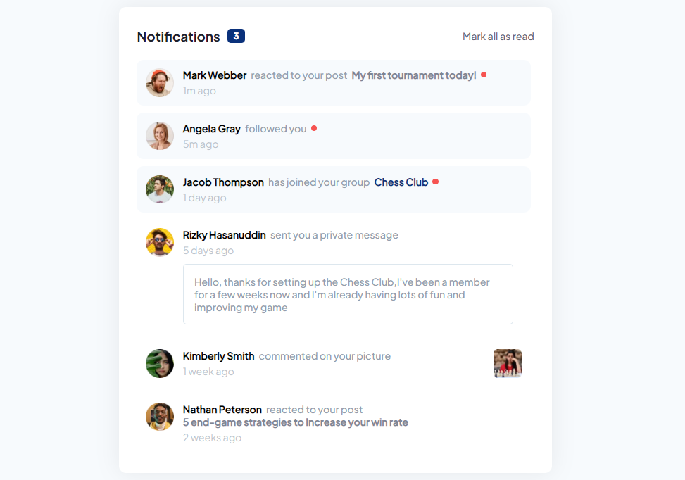
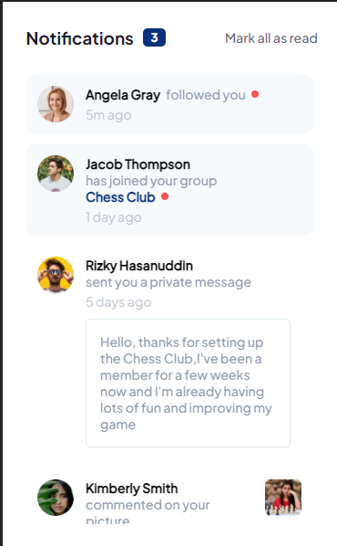
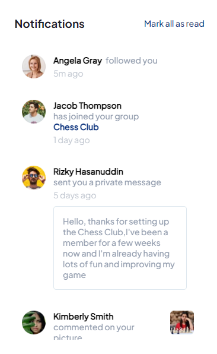

# Frontend Mentor - Notifications page solution

This is a solution to the [Notifications page challenge on Frontend Mentor](https://www.frontendmentor.io/challenges/notifications-page-DqK5QAmKbC). Frontend Mentor challenges help you improve your coding skills by building realistic projects. 

## Table of contents

- [Overview](#overview)
  - [The challenge](#the-challenge)
  - [Screenshot](#screenshot)
  - [Links](#links)
- [My process](#my-process)
  - [Built with](#built-with)
  - [What I learned](#what-i-learned)
  - [Continued development](#continued-development)
  - [Useful resources](#useful-resources)
- [Author](#author)
- [Acknowledgments](#acknowledgments)

## Overview

### The challenge

Users should be able to:

- Distinguish between "unread" and "read" notifications
- Select "Mark all as read" to toggle the visual state of the unread notifications and set the number of unread messages to zero
- View the optimal layout for the interface depending on their device's screen size
- See hover and focus states for all interactive elements on the page

### Screenshot

### Links

- Solution URL: [Git repository for the project](https://github.com/michTheBrandofficial/notification-component.git)
- Live Site URL: [Firebase app](https://notification-component-94da0.web.app)

## My process

### Built with

- Semantic HTML5 markup
- Flexbox
- [Nixix.js](https://github.com/michTheBrandofficial/NixixJS) - JS library
- Vite
- VSCode

### What I learned

- I learned more about types in javascript and how they ship less bugs to the user

### Continued development

- I will move on to create a chat app with this component using Nixix.js and Firebase

### Useful resources

## Author

- Frontend Mentor - [michTheBrandofficial](https://frontendmentor.io/profile/michTheBrandofficial)
- DEV.to - [michthebrandofficial](https://dev.to/michthebrandofficial)
- Github - [michTheBrandofficial](https://github.com/michTheBrandofficial)

## Acknowledgments

I want to say a big thanks to [Frontend Mentor](https://www.frontendmentor.io) for providing this challenge.
It has really brought back my motivation to code confidently. Thanks, again.
